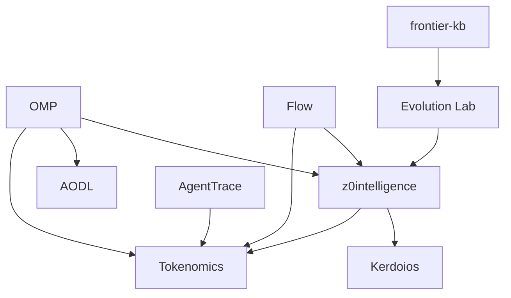

# System map

```mermaid
graph TD
  oh_my_pi["OMP"]
  tokenomics["Tokenomics"]
  flow["Flow"]
  z0intelligence["z0intelligence"]
  kerdoios["Kerdoios"]
  evolution_lab["Evolution Lab"]
  frontier_kb["frontier-kb"]
  aodl["AODL"]
  agenttrace["AgentTrace"]

  oh_my_pi --> tokenomics
  flow --> tokenomics
  flow --> z0intelligence
  z0intelligence --> tokenomics
  z0intelligence --> kerdoios
  evolution_lab --> z0intelligence
  frontier_kb --> evolution_lab
  oh_my_pi --> aodl
  oh_my_pi --> z0intelligence
  agenttrace --> tokenomics
```

Regenerate from registry: `./z0 docs generate` → `generated/graph.mmd`.
