# Local cognition portfolio

_Generated from `registry/cognition.yaml`. Do not edit by hand._

z0 owns the **stage map** and the **owner** of each stage. It does not own model
identity, roles, licences, benchmarks, measurements or promotion state — those are
canonical in z0intelligence and referenced, never copied. Kerdoios owns placement of an
already-selected capability; frontier-kb owns external evidence.

## Dataflow

| Stage | Owner component | Owner | Plane | Responsibility |
|-------|-----------------|-------|-------|----------------|
| `aodl` | `aodl` | Contracts | Decision | Typed intent and plan contract. Contracts only, never runtime execution. |
| `z0intelligence` | `z0intelligence` | Personal Intelligence | Decision | Which capability/role the turn needs, role defaults, decision receipts and promotion state. |
| `cognition-local` | `z0intelligence` + `openjev` | Personal Intelligence (decision heads with OpenJev) | Decision | Serve the selected local role. Model list, licences and measurements are the z0intelligence manifest — not stored here. |
| `kerdoios` | `kerdoios` | Compute | Compute | Given an already-selected capability and the current machine state, can it run locally now; which runtime/quant fits; co-resident or not. Never semantic suitability. |
| `omp-hermes` | `oh-my-pi` | Runtime / Interaction | Interaction | Execute the turn and the tools. Hermes remains an external host harness. |
| `tokenomics` | `tokenomics` | Measurement | Measurement | Vendor-neutral usage, cost, latency and verified-task economics. |
| `evolution-lab` | `evolution-lab` | Research | Research | Experiment search, candidate lineages, promotion gates. Consumes hypotheses from frontier-kb. |
| `frontier-kb` | `frontier-kb` | Research | Research | External evidence, source claims and falsifiable hypotheses. Not runtime state. |

```mermaid
flowchart LR
  aodl["AODL"]
  z0intelligence["z0intelligence"]
  cognition_local["Local cognition (JEV / tiny specialists / orchestrator / general SLM)"]
  kerdoios["Kerdoios"]
  omp_hermes["OMP / Hermes"]
  tokenomics["Tokenomics"]
  evolution_lab["Evolution Lab"]
  frontier_kb["frontier-kb"]
  aodl -->|intent| z0intelligence
  z0intelligence -->|selected_role| cognition_local
  cognition_local -->|placement_request| kerdoios
  kerdoios -->|execution_plan| omp_hermes
  omp_hermes -->|usage_events| tokenomics
  tokenomics -->|verified_economics| evolution_lab
  evolution_lab -->|hypotheses| frontier_kb
  frontier_kb -->|evidence| evolution_lab
  evolution_lab -->|promotion_candidates| z0intelligence
```



## Model list (referenced from z0intelligence)

| What | Canonical source |
|------|------------------|
| Model list, roles, licences, gated access | `kvnloo/z0intelligence` → `manifests/local_cognition.v1.json` |
| Load the manifest | `z0int cognition manifest --json` |
| Role view | `z0int cognition roles --json` |
| Resource placement (already-selected capability) | `kvnloo/kerdoios` |
| External evidence and hypotheses | `kvnloo/frontier-kb` |
| Resolution on this machine | referenced only — z0 never stores the model list (unresolved at generation time) |

Render the live portfolio on this machine:

```bash
./z0 cognition portfolio          # human view
./z0 cognition portfolio --json   # machine view
```
