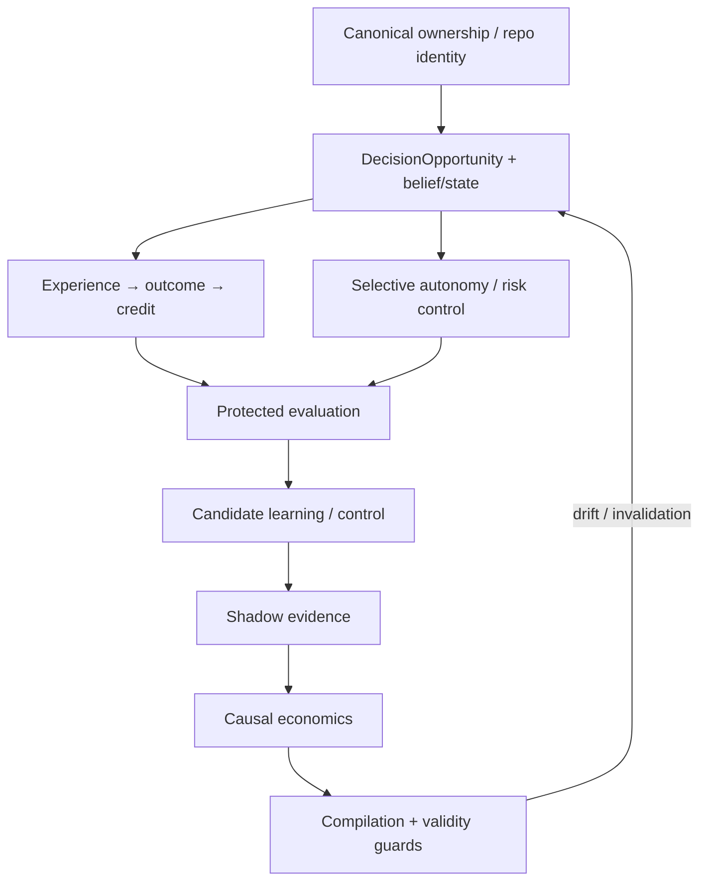

# Verified Learning Control Loop — cross-repo RFC index

Status: Draft / research program  
Parent discussion: https://github.com/kvnloo/z0/issues/15  
Research cutoff: 2026-09-30

## North star

Organize Zer0 around a **verified learning control loop over personal decision states**, not around a preferred model family.

```text
evidence
  ↓
evidence-derived belief / current state
  ↓
DecisionOpportunity
  ↓
legal candidate actions + deterministic authority
  ↓
ACT / OBSERVE / ASK / ABSTAIN / ESCALATE
  ↓
harness execution
  ↓
independent outcome
  ↓
credit / counterfactual evidence
  ↓
learn / specialize / compile when justified
  ↓
monitor validity
  ↓
deoptimize on drift / invalidation
```

The objective remains to increase **verified useful work per scarce cognition and scarce human attention** without hiding displaced cost or weakening quality, privacy, authority, calibration, provenance, or recoverability.

## Canonical repository map

| Repository / surface | Owns | Explicit non-ownership |
|---|---|---|
| `kvnloo/z0` | canonical ecosystem map, ownership, interfaces, architecture contracts | runtime cognition/orchestration |
| `kvnloo/z0intelligence` | evidence→state→decision cognition runtime; selective autonomy; specialists; compilation validity | sealed judge; provider placement |
| `kvnloo/z0evals` | frozen/reproducible studies; protected evaluation contracts | model training/search |
| `kvnloo/evolution-lab` | candidate search, training, ABAB, Pareto/MAP-Elites, promotion experiments | sealed truth; production authority |
| `kvnloo/frontier-kb` | public research memory, prior art, contradictions, kill criteria | private personal runtime memory |
| `kvnloo/tokenomics` | neutral usage/cost/outcome/measurement semantics | semantic routing policy |
| `kvnloo/kerdoios` | provider/resource placement and quota economics after semantic choice | semantic suitability |
| `kvnloo/aodl` | authored intent, authority, budgets, structural orchestration IR | mutable learned belief/current state |
| OMP / Hermes / DeepSeek harnesses | execution + replayable trajectory/event sources | cross-harness cognition policy |
| AgentsView / memory surfaces | archival evidence indexing/retrieval | authoritative current belief |
| Verified OSS Loop | software-change evidence/governance | agent cognition |

Identity drift is tracked in https://github.com/kvnloo/z0/issues/16. In particular, do not assume historical `kvnloo/flow` is the current canonical Flow implementation until the registry audit resolves it.

## RFC set

### 1. DecisionOpportunity + evidence-derived belief/state

https://github.com/kvnloo/z0intelligence/issues/53

Defines the candidate natural control unit and keeps:

```text
evidence ≠ belief/state ≠ authority ≠ action ≠ outcome
```

Related existing work: z0intelligence #22/#23/#12/#13/#28, AODL #32, z0evals #56.

### 2. Experience → outcome → counterfactual credit

https://github.com/kvnloo/z0intelligence/issues/54

Defines how trajectories become learnable evidence without assuming observed behavior is the optimal label or that teacher/reference agreement is gold.

Research child: https://github.com/kvnloo/z0intelligence/issues/58

### 3. Selective autonomy / pre-action risk control

https://github.com/kvnloo/z0intelligence/issues/55

Defines ACT / OBSERVE_MORE / ASK / ABSTAIN / ESCALATE semantics, family-specific risk/coverage, calibration provenance and fallback. Model confidence never grants authority.

### 4. Personalization evaluation

https://github.com/kvnloo/z0evals/issues/71

Requires personalized systems to compete with strong generic and retrieval-only baselines on future/longitudinal user distributions.

Study child: https://github.com/kvnloo/z0evals/issues/73

### 5. Compilation validity, drift and deoptimization

https://github.com/kvnloo/z0intelligence/issues/56

Replaces a fixed global model ladder with mechanism-neutral promotion to the cheapest verified mechanism whose empirical validity assumptions still hold.

Research children:
- https://github.com/kvnloo/z0intelligence/issues/59
- https://github.com/kvnloo/evolution-lab/issues/25

### 6. Causal economics / verified useful work

https://github.com/kvnloo/tokenomics/issues/19

Measures frontier cognition truly removed versus cost displaced into local compute, latency, retries, context movement or human correction.

### 7. Protected continual evaluation

https://github.com/kvnloo/z0evals/issues/72

Keeps optimizer/search separate from protected truth over repeated adaptive experiments.

Study child: https://github.com/kvnloo/z0evals/issues/74

## Additional research issues

- Natural unit of cognition/control: https://github.com/kvnloo/z0intelligence/issues/57
- Unknown-unknown + adjacent-mechanism atlas: https://github.com/kvnloo/frontier-kb/issues/34
- Canonical repo identity/ownership audit: https://github.com/kvnloo/z0/issues/16

AgentsView and DeepSeek Harness currently have GitHub Issues disabled, so their evidence/archive and harness-integration boundaries are recorded here and in the parent RFC rather than inventing an issue location.

## Existing issues explicitly reused

| Repo | Issue | Role in this program |
|---|---:|---|
| z0 | #1 | federated network almanac / identity map |
| z0 | #3 | JEV observer/evaluation plane |
| z0 | #5 | local cognition portfolio registry |
| z0intelligence | #14 | observer-first receipts + calibration |
| z0intelligence | #22 | State Packet / state compiler |
| z0intelligence | #27 | observer/label disagreement audit |
| z0intelligence | #28 | evolve state construction |
| Evolution Lab | #20 | grouped backend-neutral observer eval |
| Evolution Lab | #24 | verified-trajectory state/action learning |
| z0evals | #5 | federated eval suites |
| z0evals | #56 | unified memory + State Packet study |
| z0evals | #65 | SOTA/meta-research publication |
| Tokenomics | #4 | orchestration/tool-calling control measurement |
| AODL | #32 | epistemic state selection / verified observe→act |
| Kerdoios | #50 | resource-aware local cognition placement |
| OMP | #81 | assistance vs evaluation/authority |
| Hermes | #319/#322 | z0 shadow decisions + common receipts/failure injection |
| frontier-kb | #20 | Agent OS evidence map |
| Verified OSS Loop | #14 | archetypes/collision/evidence discipline |

These issues have been cross-linked rather than duplicated.

## Epistemic dependency DAG



This is not a time-based roadmap. It describes what must exist before a later claim can be evaluated.

## “Do not put this here” table

| Repository | Do not put here |
|---|---|
| z0 | live cognition/runtime state |
| z0intelligence | sealed truth, provider quota ownership |
| z0evals | training/search loops, mutable production state |
| Evolution Lab | authoritative labels/judge, production authority |
| frontier-kb | private user/session memory |
| Tokenomics | semantic routing policy |
| Kerdoios | semantic task/capability choice |
| AODL | mutable learned belief store |
| harnesses | cross-harness personal cognition policy |
| archival memory tools | authority/current truth without state resolution |

## Architecture migration

| Old framing | New framing |
|---|---|
| “army of flies” as product architecture | candidate mechanism family |
| deterministic→fly→JEV→SLM→frontier as global hierarchy | mechanism-neutral Pareto promotion per decision region |
| JEV agreement as implicit correctness | observer/reference evidence only |
| retrieval hit = current state | evidence input to state construction |
| observed action = training label | observational evidence requiring outcome/counterfactual context |
| confidence threshold = autonomy | family-specific selective risk/coverage + deterministic authority |
| fewer frontier calls = savings | verified useful work + full displaced-cost accounting |
| compiled routine is permanently cheaper | compiled mechanism with validity assumptions + deoptimization |
| personalization is a product claim | frozen longitudinal measured capability |

## Research questions that should remain questions

Do not prematurely turn these into implementation epics:

1. What is the natural unit of cognition: task, decision, state transition, trajectory segment, DecisionOpportunity, or state-region?
2. When does learned personalization beat retrieval-only adaptation on future user distributions?
3. What level of counterfactual/causal attribution is worth its complexity?
4. At what recurrence rate does compilation repay discovery, training, verification, drift and maintenance cost?
5. Can confidence/calibration improve safe coverage over deterministic gates + escalation?
6. What is the minimum evidence-derived state sufficient to cause the correct next action?
7. When should a compiled policy invalidate itself?
8. Is anticipatory prediction/preparation more valuable than reactive cognition on real workflows?
9. Which 2025–2026 mechanisms do not fit the current routing/memory/specialist vocabulary?
10. Which current Zer0 layers should disappear if a simpler mechanism dominates them?

## Evidence standard

Every consequential claim should answer:

- What do we know?
- How do we know it?
- Compared with what?
- On which distribution?
- Under which assumptions?
- Does it transfer?
- What would falsify it?

Negative and inconclusive evidence is publishable. Code existence is not capability proof. Execution is not verified success. Missing telemetry is not zero cost.
